# Breaking the Tie: A Cluster-Aware Routing Framework for Large Language Models

[](https://www.python.org/)
[](#method)
[](#reproduction)
[](#license)

This repository contains the organized research code for **Breaking the Tie: A Cluster-Aware Routing Framework for Large Language Models**. The method introduced in the paper is **CASLR**: Cluster-Aware Soft-Labeling Routing.

> CASLR is the method name. The project title follows the paper title.

<p align="center">
  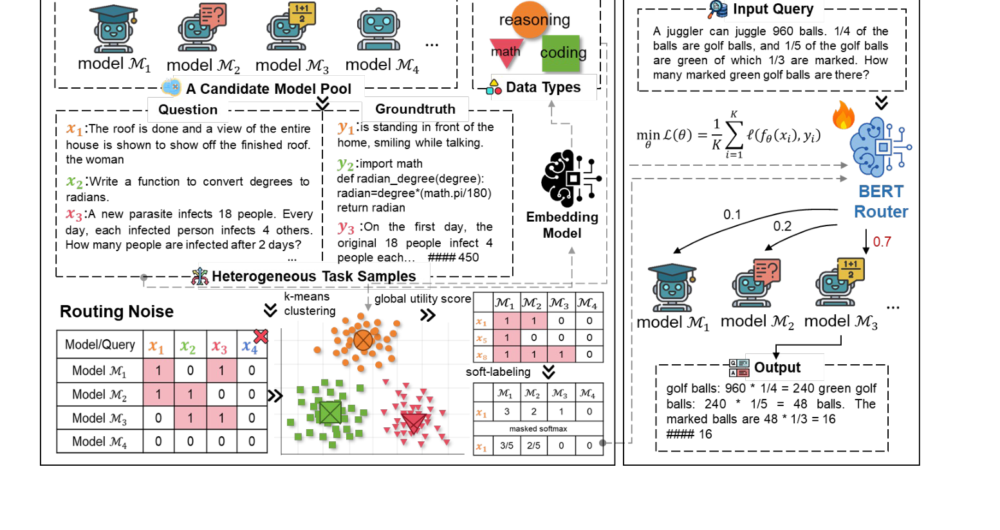
</p>

## Overview

LLM routing selects one expert model from a candidate pool for each input query. Existing routers often reduce this to ordinary classification, but this creates a failure mode when multiple experts answer the same query correctly. The paper formalizes this as **routing noise** and shows how it can lead to **routing collapse** on unseen tasks.

CASLR resolves the tie by moving from single-query success to **cluster-level domain consensus**:

1. Encode queries into a semantic space.
2. Cluster related queries with KMeans.
3. Compute each expert's cluster-level utility.
4. Assign zero probability to experts that fail the current query.
5. Apply masked softmax over successful experts using cluster utility scores.
6. Train a lightweight BERT router with the refined soft labels.

<p align="center">
  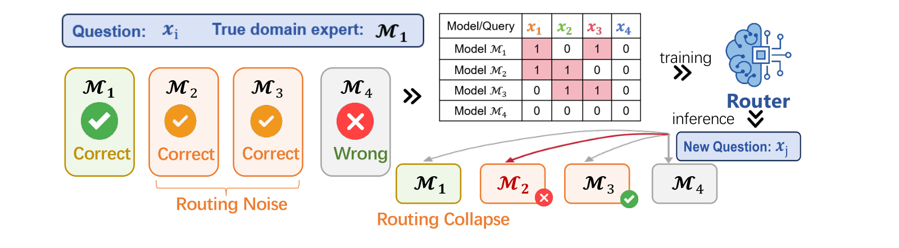
</p>

## Method

<p align="center">
  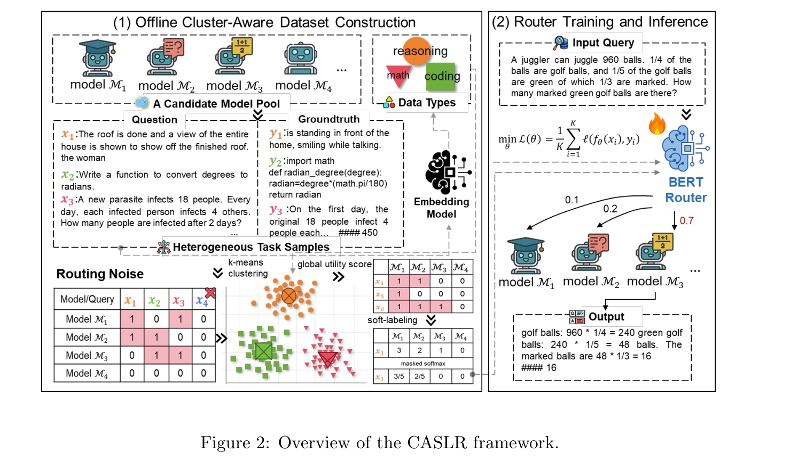
</p>

The code mirrors the paper pipeline:

- `src/caslr/data.py`: loads benchmark files with `question` and `router_<expert>` columns.
- `src/caslr/embeddings.py`: supports deterministic sample embeddings and Hugging Face/BGE encoders.
- `src/caslr/clustering.py`: KMeans clustering and cache helpers.
- `src/caslr/labels.py`: cluster utility, masked-softmax soft labels, hard-label ablation, and random-success labels.
- `src/caslr/training.py`: BERT sequence-classification router trained with soft-label cross entropy.
- `src/caslr/inference.py`: query-to-expert routing API.
- `src/caslr/evaluation.py`: expert accuracy, router accuracy, oracle/random baselines, and selection ratios.
- `src/caslr/analysis.py`: routing-noise summary and routing-collapse utility-gap estimate.

For a detailed derivation, see [docs/method.md](docs/method.md).

## Repository Structure

```text
.
+-- README.md
+-- AGENT.md
+-- pyproject.toml
+-- requirements.txt
+-- configs/
+-- data/
|   +-- sample/
+-- docs/
|   +-- assets/
|   +-- method.md
|   +-- reproduction.md
|   +-- results.md
|   +-- code_inventory.md
+-- scripts/
+-- src/caslr/
+-- tests/
```

The original experimental scripts were used as local source material during cleanup. Public workflows are organized through `src/caslr/` and `scripts/`.

## Installation

```bash
python -m venv .venv
. .venv/bin/activate
pip install -e ".[dev]"
```

Windows PowerShell:

```powershell
python -m venv .venv
.\.venv\Scripts\Activate.ps1
pip install -e ".[dev]"
```

## Data Format

Input data can be CSV, TSV, XLS, or XLSX. Each file must contain:

- `question`: user query.
- `dataset`: benchmark/task name. If omitted, the file stem is used.
- `router_<expert_name>`: binary correctness label for each expert.

Example:

```csv
question,dataset,router_Qwen2.5-7B-Instruct,router_Qwen2.5-Math-7B-Instruct
"Solve 2+2.",Math,1,1
"Write binary search.",MBPP,0,1
```

A synthetic sample is provided at [data/sample/sample_router_data.csv](data/sample/sample_router_data.csv). It is only for checking the code path and documentation examples.

## Quick Start

Prepare cluster-aware soft labels:

```bash
python scripts/prepare_dataset.py --config configs/default.yaml --sample
```

Evaluate base expert columns:

```bash
python scripts/evaluate_experts.py --config configs/default.yaml --sample
```

Evaluate prepared router labels or saved predictions:

```bash
python scripts/evaluate_router.py --config configs/default.yaml --sample
```

Train the BERT router:

```bash
python scripts/train_router.py --config configs/five_expert.yaml
```

Measure router latency:

```bash
python scripts/measure_latency.py --config configs/five_expert.yaml --query "Solve 2+2." --dataset Math
```

## Reproduction

Full reproduction requires the benchmark files used by the paper, candidate expert correctness columns, and local/Hugging Face access to the configured BGE and BERT models. See [docs/reproduction.md](docs/reproduction.md).

This cleanup pass does not ship raw benchmark data, trained checkpoints, or a final paper URL because those release decisions depend on data/model licensing and publication status.

## Results

The paper reports that the five-expert CASLR configuration reaches **79.79%** average accuracy and that the nine-expert configuration reaches **85.00%** average accuracy. The router latency reported on HumanEval is **1.13s**, compared with thousands of seconds for candidate LLM generation time in the same setting.

### Main Routing Baselines

<p align="center">
  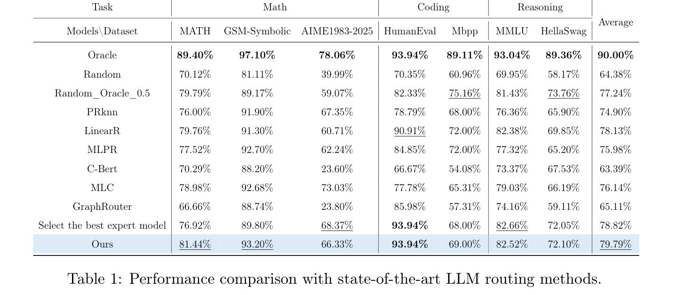
</p>

### Large-Scale LLM Comparison

<p align="center">
  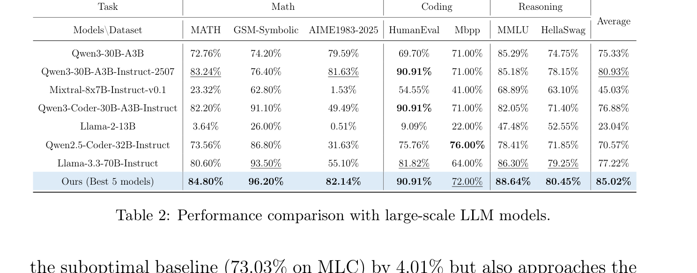
</p>

CASLR also visualizes how the router distributes queries to experts across tasks. These distribution figures make the routing behavior inspectable, which is useful when analyzing whether the router is relying on domain specialists rather than a single general model.

<p align="center">
  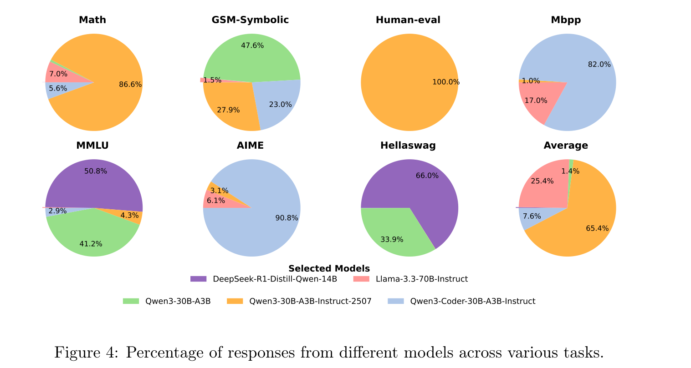
</p>

### Expert Pool Size

<p align="center">
  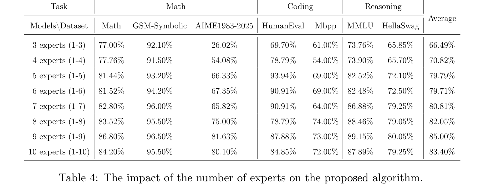
</p>

| Expert pool | Math | GSM-Symbolic | AIME1983-2025 | HumanEval | MBPP | MMLU | HellaSwag | Average |
|---|---:|---:|---:|---:|---:|---:|---:|---:|
| 3 experts (1-3) | 77.00 | 92.10 | 26.02 | 69.70 | 61.00 | 73.76 | 65.85 | 66.49 |
| 5 experts (1-5) | 81.44 | 93.20 | 66.33 | 93.94 | 69.00 | 82.52 | 72.10 | 79.79 |
| 9 experts (1-9) | 86.80 | 96.50 | 81.63 | 87.88 | 73.00 | 89.15 | 80.05 | 85.00 |
| 10 experts (1-10) | 84.20 | 95.50 | 80.10 | 84.85 | 72.00 | 87.89 | 79.25 | 83.40 |

### Candidate Model Quality

<p align="center">
  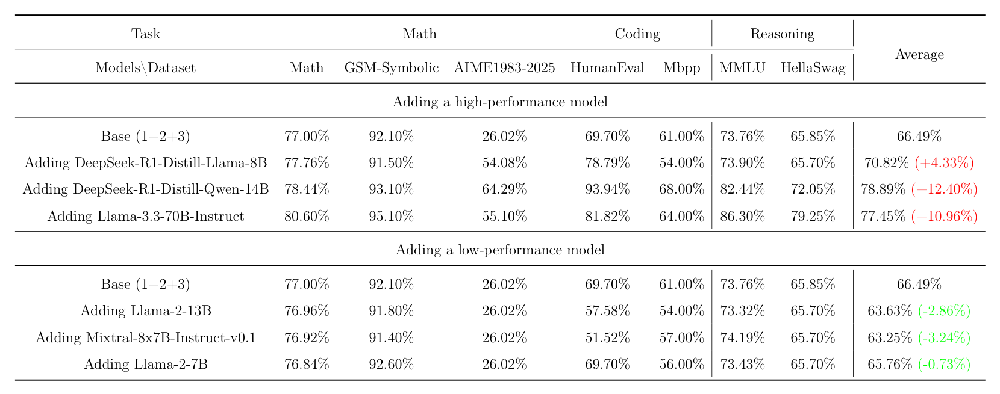
</p>

### Router Latency

<p align="center">
  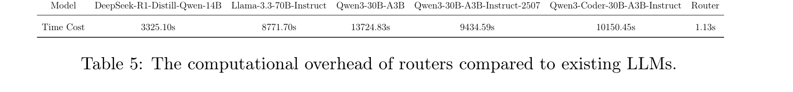
</p>

### Soft-Labeling Ablation

<p align="center">
  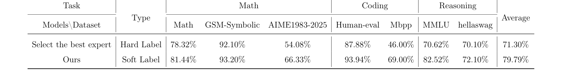
</p>

| Labeling strategy | Math | GSM-Symbolic | AIME1983-2025 | HumanEval | MBPP | MMLU | HellaSwag | Average |
|---|---:|---:|---:|---:|---:|---:|---:|---:|
| Hard label | 78.32 | 92.10 | 54.08 | 87.88 | 46.00 | 70.62 | 70.10 | 71.30 |
| CASLR soft label | 81.44 | 93.20 | 66.33 | 93.94 | 69.00 | 82.52 | 72.10 | 79.79 |

### Additional Routing Distributions

<p align="center">
  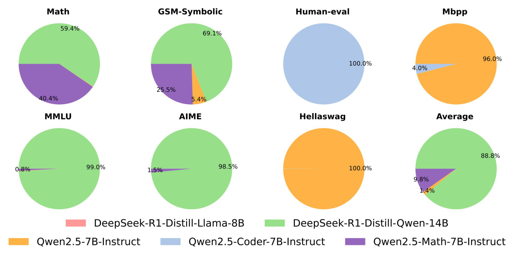
</p>

<p align="center">
  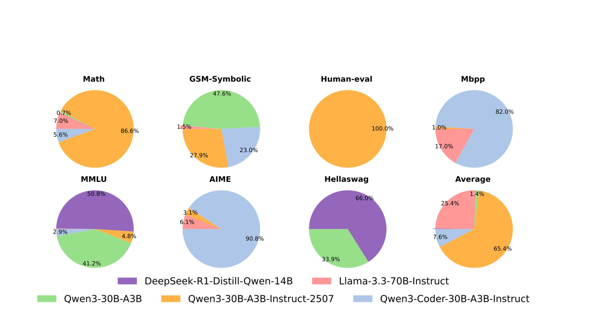
</p>

<p align="center">
  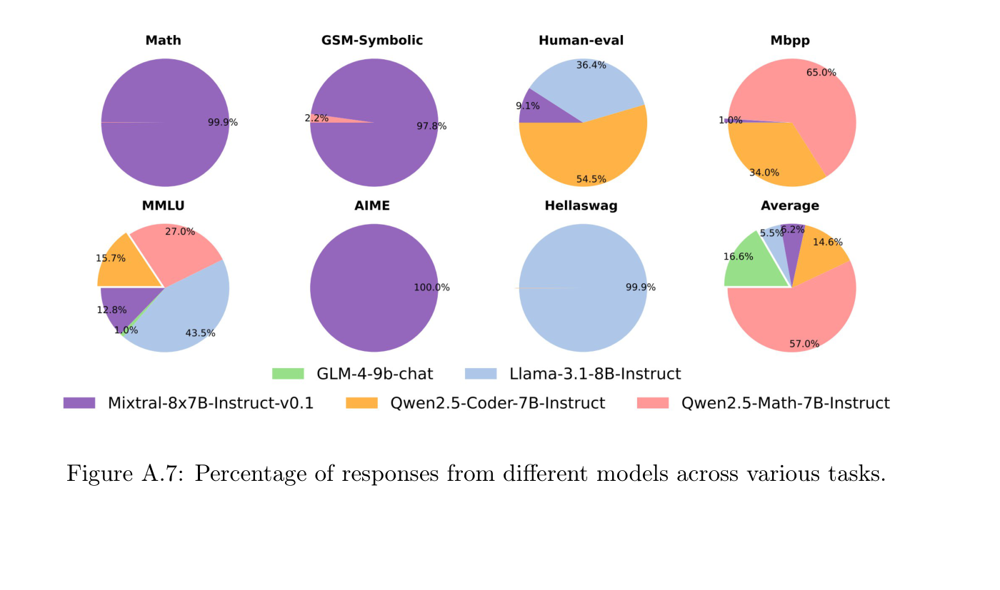
</p>

<p align="center">
  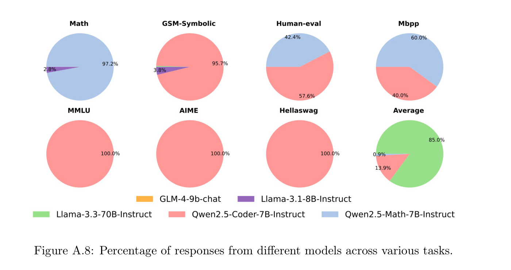
</p>

More tables are in [docs/results.md](docs/results.md).

## Citation

```bibtex
@article{lu2026breakingtie,
  title = {Breaking the Tie: A Cluster-Aware Routing Framework for Large Language Models},
  author = {Lu, Yao and Ji, Zhaiyuan and Gao, Yaxin and Wang, Zeyu and Tang, Zhe and Wei, Jiaheng and Zhu, Zhaowei and Yu, Shanqing and Xuan, Qi},
  year = {2026},
  note = {Manuscript under review}
}
```

## License

License selection is pending repository-owner confirmation.

## Acknowledgments

This repository follows the paper's research code and documentation structure. The README embeds paper-derived figure and table crops so that the GitHub page mirrors the academic presentation style of the paper.
